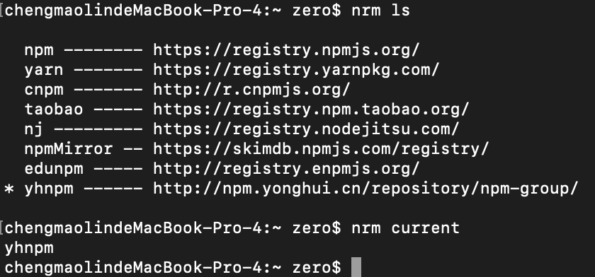
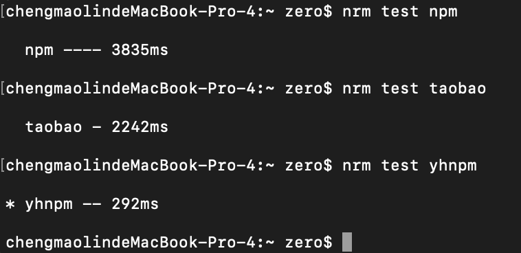

#一、npm
npm会随着 Node.js 自动安装。npm 模块仓库提供了一个名为 “registry” 的查询服务，用户可通过本地的 npm 命令下载并安装指定模块。「[维基百科](https://zh.wikipedia.org/wiki/Npm)」

## 1、NPM 常用命令
* NPM提供了很多命令，例如 install 和 publish，使用 npm help 可查看所有命令。
* 使用npm help <command>可查看某条命令的详细帮助，例如 npm help install。
* 在 package.json 所在目录下使用 npm install . -g 可先在本地安装当前命令行程序，可用于发布前的本地测试。
* 使用 npm update <package> 可以把当前目录下 node_modules 子目录里边的对应模块更新至最新版本。
* 使用 npm update <package> -g 可以把全局安装的对应命令行程序更新至最新版。
* 使用 <span style="color:red;">npm cache clear</span> 可以清空 NPM 本地缓存，用于对付使用相同版本号发布新版本代码的人。
* 使用 npm unpublish <package>@<version> 可以撤销发布自己发布过的某个版本代码。

##2、使用淘宝 NPM 镜像
大家都知道国内直接使用 npm 的官方镜像是非常慢的，这里推荐使用淘宝 NPM 镜像。

淘宝 NPM 镜像是一个完整 [npmjs.org](http://npmjs.org/) 镜像，你可以用此代替官方版本(只读)，淘宝 NPM 镜像同步频率目前为 10分钟 一次以保证尽量与官方服务同步。

切换淘宝 NPM 镜像命令：
```
$ nom get registry    // 查看-当前镜像地址
> https://registry.npmjs.org/

$ npm config set registry http://registry.npm.taobao.org/    // 切换-淘宝镜像

$ npm config set registry https://registry.npmjs.org/    // 切换-默认镜像
```

##3、个人分享
可 “简写” 的命令：
```
$ npm i     // npm install
$ npm -D    // npm -save-dev [安装包信息将加入到 devDependencies（开发阶段的依赖），所以开发阶段一般使用它]
$ npm -S    // npm -save [安装包信息将加入到 dependencies（生产阶段的依赖）]
$ npm init  // 用于初始化项目，生成 package.json；也可查看每个模块具体信息
$ npm run   // 用于执行脚本。package.json 文件有一个 scripts 字段，可以用于指定脚本命令，供 npm 直接调用
```

##4、推荐文章
* [npm 常用命令详解](https://www.cnblogs.com/PeunZhang/p/5553574.html)
* [npm命令详解](https://juejin.im/post/6844904008830681096#heading-7)

#二、cnpm
因为 npm 插件是从国外服务器（ [npmjs.org](http://npmjs.org/) ）下载，受网络影响大，可能出现异常.

淘宝团队干了这事来自官网：“这是一个完整 [npmjs.org](http://npmjs.org/) 镜像，你可以用此代替官方版本（只读），同步频率目前为10分钟一次以保证尽量与官方服务同步“。

##1、安装
你也可以使用淘宝定制的 cnpm (gzip 压缩支持) 命令行工具代替默认的 npm：
```
$ npm install -g cnpm    // 本地安装 cnpm

$ npm install cnpm -g --registry=https://registry.npm.taobao.org    // 国内安装 mirror

$ cnpm -v // 检查是否安装成功
```

##2、个人分享
本质上和 npm 命令一致，故 cnpm 也都是支持。

##3、推荐文章
* [淘宝 NPM 镜像](https://developer.aliyun.com/mirror/NPM?from=tnpm)

#三、yarn
yarn 是 Facebook 发明的新一代 js 包管理器，还可已作为项目管理工具，并支持离线模式。

##1、安装
```
$ npm i -g yarn // 本地全局安装
```
        
##2、yarn 和 npm 命令对比
| npm | yarn |
| --- | ---- |
| npm install | yarn |
| npm install react --save | yarn add react |
| npm uninstall react --save | yarn remove react |
| npm install react --save-dev | yarn add react --dev |
| npm update --save | yarn upgrade |

##3、推荐文章
* [npm 和 yarn 的区别](https://www.jianshu.com/p/254794d5e741)

#四、nrm
nrm 是 npm 的镜像源管理工具，有时候国外资源太慢，使用这个可已快速地在 npm 源jian切换。

##1、安装
```
$ npm i -g nrm // 本地全局安装
```

##2、使用
* 查看可选源（带 * 号即为当前使用源）
```
$ nrm ls // 输出可选源
$ nrm current // 查看当前使用源
```


* 切换源
```
$ nrm use taobao // 切换淘宝源
```

* 添加源
```
$ nrm add <registry> <url> // registry：源名，url：源地址
// 例如：添加公司私有的 npm 源，源地址为  http://npm.***.cn/repository/npm-group/，源名为：yhnpm。
$ nrm add yhnpm http://npm.***.cn/repository/npm-group/
```

* 删除源
```
$ nrm del <registry> // registry：源名
// 例如：删除公司私有的 npm 源
$ nrm del yhnpm
```

* 测试源速度（即响应时间）
```
$ nrm test <registry> // registry：源名
// 例如：测试官方源、淘宝源和公司源的响应时间
$ nrm test npm
$ nrm test taobao
$ nrm test yhnpm
```


#五、yrm
yrm 是 yarn 的镜像源管理工具，同 nrm 命令一致。

#六、nvm
它是管理 node 版本的工具，一台电脑可以安装多个版本的 node，nvm 则是提供切换 node 版本的工具。

##1、安装
```
$ npm install -g nvm // 本地全局安装
```
         
##2、管理 node
* 查看本地安装的所有 node 版本，可选参数 available ，显示所有可下载的版本。
```
$ nvm list [available]
```
* 安装指定 node 版本
```
$ nvm install v8.12.0
```
* 使用指定 node 版本
```
$ nvm use v8.12.0
```
* 卸载指定 node 版本
```
$ nvm uninstall v8.12.0
```

##3、个人分享
可 “简写” 的命令：
```
$ nvm ls    // nvm list
$ nvm use v8.12.0 // 使用该命令切换 node 时，提示如下错误：
// Run `npm config delete prefix` or `nvm use --delete-prefix v8.12.0` to unset it.
// 亲测最有效是 `nvm use --delete-prefix v8.12.0`
```

#七、npm-check
npm-check 是一个 npm 包更新工具。它还可以检查项目的 npm 依赖包是否有更新、缺失、错误以及未使用的依赖等情况。
主要优势：
* 提供图形化界面，还有 emoji
* 批量更新依赖包，还兼容检测包使用情况
* 项目下更新支持自动检测包的“dependencies” 和 “devDependencies” 并更新 “package.json”  信息

##1、安装
```
$ npm i -g npm-check // 本地全局安装
```
   
##2、使用
* 查看包更新信息，会有小黄脸提示包的相关情况
```
$ npm-check
```
* 更新包。分类别展示，使用空格切换包是否检查更新， enter 执行更新，Control + c 取消更新。会自动更新 package.json 内的相关包信息。
```
$ npm-check -u // update
```
* 指令列表
```
-u, —-update        显示一个交互式IUI，用于选择要更新的模块，并启动更新“package.json”内包版本号信息
-g, —-global        检查全局下的包
-s, —-skip-unused   忽略对未使用包的更新检查
-p, —-production    忽略对“devDependencies”下的包的检查
-d, —-dev-only      忽略对“dependencies”下的包的检查
-i, —-ignore        忽略对指定包的检查
-E, —-save-exact    将确切的包版本存至“package.json”（⚠️注意，此命令将存储'x.y.z’而不是’^x.y.z'）
```

#八、最后
不推荐使用 cnpm 。为了加快安装依赖包的安装速度，可能被同事安装 cnpm，但是这样会导致包的依赖安装不正确，项目无法运行。

更好的做法是使用 nrm 切换下载源。

另一种就是在项目中添加 .npmrc 文件，下期将详细介绍它。

欢迎🙏留言🙏交流🙏

#参考：
1. [npm、yarn、cnpm基本命令](https://www.cnblogs.com/zcy9838/p/11606384.html)
2. [npm，yarn如何查看源和换源](https://zhuanlan.zhihu.com/p/35856841)
3. [nrm 安装与使用](https://www.cnblogs.com/Jimc/p/10280774.html)
4. [npm模块管理进阶 — npm-check  + cpm 构建包更新环境](https://segmentfault.com/a/1190000011085967)
5. [一行命令更新所有 npm 依赖包](https://nusr.github.io/post/2019/2019-04-21-update-all-npm-package/)

#附录：
1、npm, yarn查看源和换源：
```
npm config get registry  // 查看npm当前镜像源

npm config set registry https://registry.npm.taobao.org/  // 设置npm镜像源为淘宝镜像

yarn config get registry  // 查看yarn当前镜像源

yarn config set registry https://registry.npm.taobao.org/  // 设置yarn镜像源为淘宝镜像
```

2、镜像源地址部分如下：
```
npm --- https://registry.npmjs.org/

cnpm --- https://r.cnpmjs.org/

taobao --- https://registry.npm.taobao.org/

nj --- https://registry.nodejitsu.com/

rednpm --- https://registry.mirror.cqupt.edu.cn/

npmMirror --- https://skimdb.npmjs.com/registry/

deunpm --- http://registry.enpmjs.org/
```
