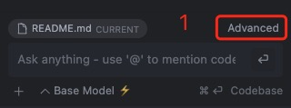

#cursor

### 插件 codeium chat 
- 扩展里搜索 Codeium
- [使用AI工具Codeium提高编码效率](https://juejin.cn/post/7366062210932867126)
- 如何将回复内容设置为中文：
  [VS code 插件 Codeium 有办法设置默认中文回答嘛？](https://linux.do/t/topic/194227)

  在 cursor 设置 CONTEXT 打开方式：
  
  Step 1: 点击
  
  
  
  Step 2: 设置
  
  
  
  Setp 3: 添加
  
  ```
  All responses are in Simplified Chinese.
  ```
